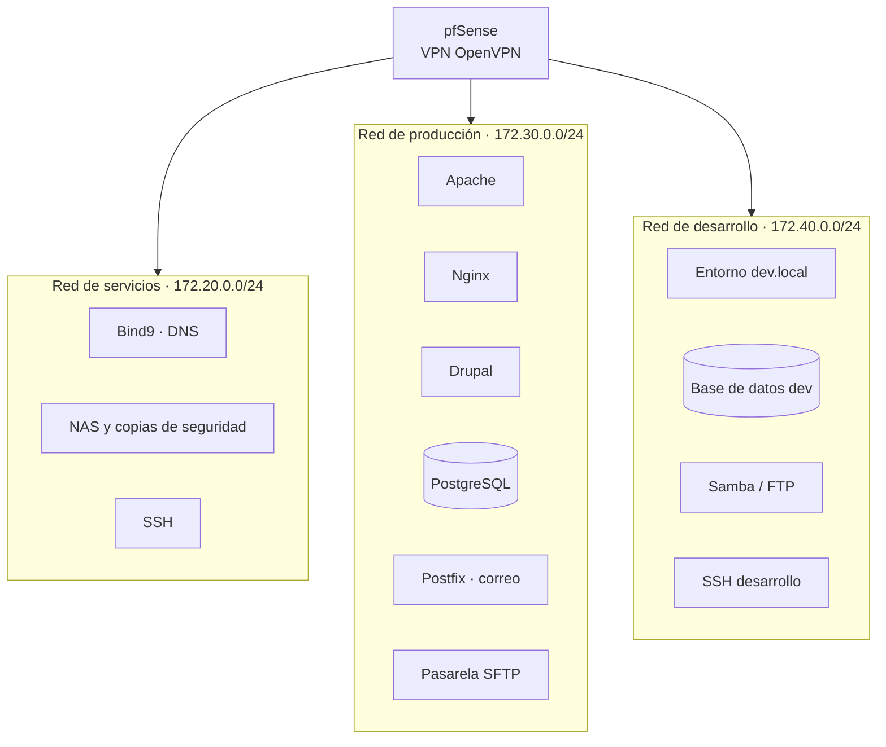

# Infraestructura de servicios con Docker y pfSense

Proyecto de **Administración de Sistemas** (Ingeniería Informática, Universidad de Cádiz) en el que desplegamos la infraestructura de una empresa ficticia: servicios de red, correo, web y bases de datos en contenedores Docker, separados en redes de **producción**, **desarrollo** y **servicios**, con acceso remoto por VPN a través de **pfSense**.

Trabajo en equipo: José Luis Olmo Barberá, Víctor Manuel Vidal Molina y Álvaro Griñón Martínez.

## Arquitectura

Cada red es una red Docker **macvlan** asociada a una interfaz distinta del host, de modo que los entornos quedan aislados entre sí y se acceden según el perfil del usuario.

## Servicios

| Área | Servicios | Carpeta |
|---|---|---|
| Servicios comunes | DNS con Bind9, NAS con copias de seguridad, SSH | [`services/`](PRACTICAS/services) |
| Producción | Apache, Nginx, Drupal, PostgreSQL, correo con Postfix, pasarela SFTP | [`production/`](PRACTICAS/production) |
| Desarrollo | Entorno web de desarrollo, base de datos, Samba/FTP, SSH | [`development/`](PRACTICAS/development) |

La orquestación está en [`docker-compose.yml`](PRACTICAS/docker-compose.yml) y cada servicio tiene su propio `Dockerfile` y configuración.

## Documentación

La memoria técnica de cada servicio está en [`DOCUMENTACIONES/`](PRACTICAS/DOCUMENTACIONES): SSH, FTP, Apache y Postfix.

## Tecnologías

Docker · Docker Compose · redes macvlan · pfSense · OpenVPN · Bind9 · Apache · Nginx · Postfix · Samba · SFTP · Drupal · PostgreSQL · Linux
